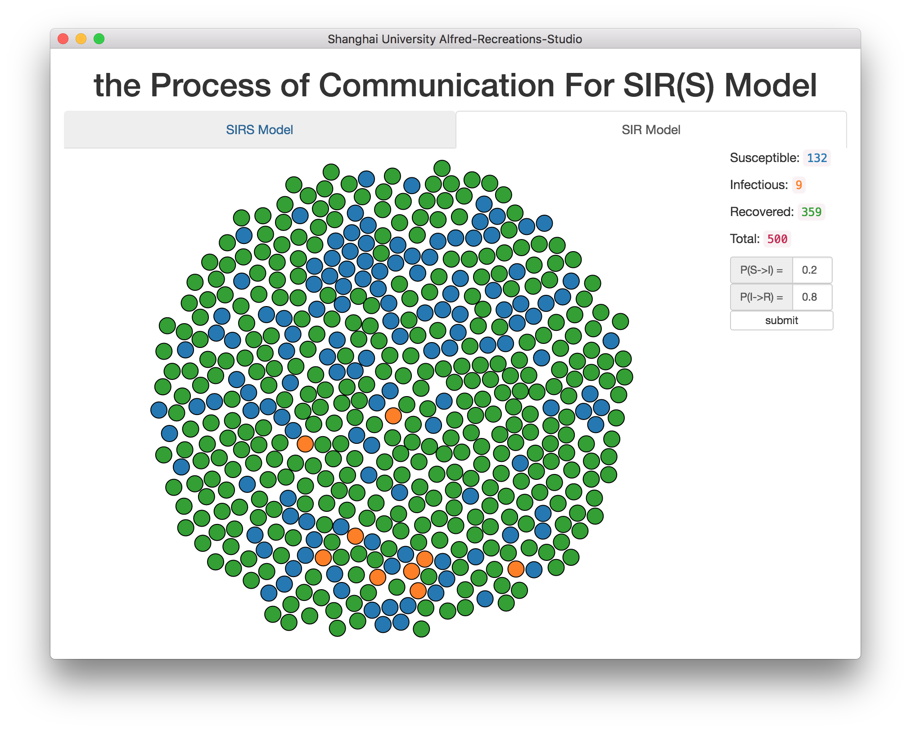
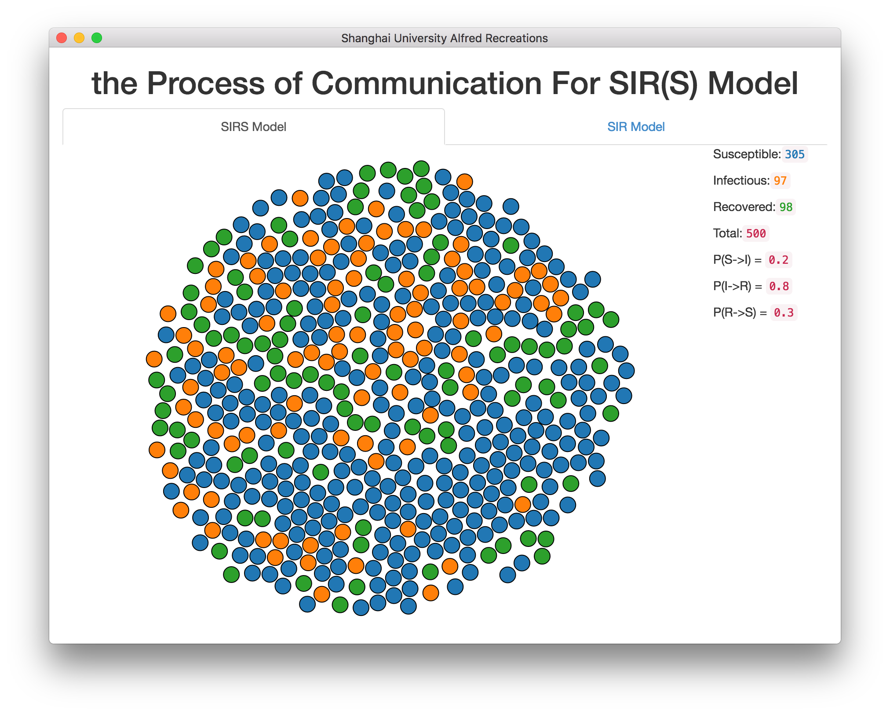

# SIR(S) model data visualization

This is a demo for showing the process of communication for SIRS model and SIR model
In the SIR model, you also can change the infected rate and recovered rate to see each circumstance.

##Preview
- SIR model

- SIRS model

##Thanks

- D3.js & electron

## License

[MIT licensed](LICENSE)